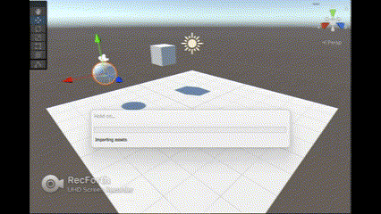
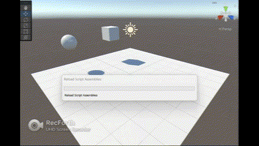
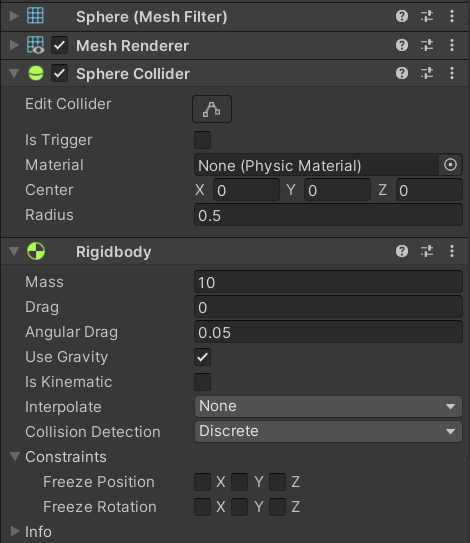
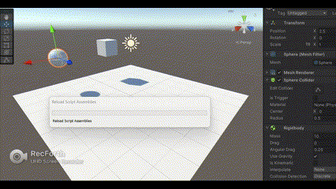
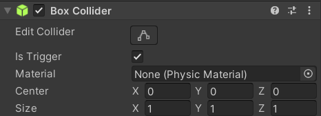
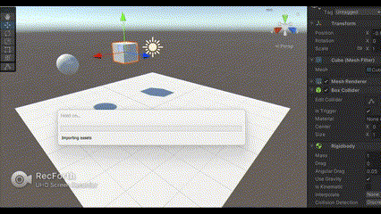
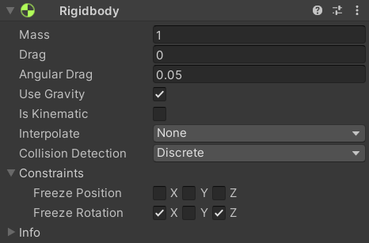

# Práctica 2 Interfaces Inteligentes
## Marta Molina Fernández

<!-- TABLE OF CONTENTS -->
<details open="open">
  <summary>Table of Contents</summary>
  <ol>
    <li><a href="#ejercicio-1">Ejercicio 1</a></li>
    <li>
      <a href="#ejercicio-2">Ejercicio 2</a>
    </li>
    <li><a href="#ejercicio-3">Ejercicio 3</a></li>
  </ol>
</details>

## Ejercicio 1
### A
Ninguno de los objetos es físico:



### B
La esfera es física gracias a Component > Physics > Rigidbody


### C
Ambos objetos tienen físicas



### D
Ambos son físicos y la esfera tiene 10 veces la masa del cubo





### E
Esfera física y el cubo es de tipo trigger




### F
La esfera tiene físicas y el cubo además de trigger, tiene físicas (activadas como anteriormente con el rigibody)



### G
La esfera, con una masa 10 veces mayor a la del cubo, y el cubo son físicos. Se impide la rotación del cubo sobre el plano XZ.

La masa se aumenta en el inspector como anteriormente se mostró.




## Ejercicio 2

Código: 

``` C#

using System.Collections;
using System.Collections.Generic;
using UnityEngine;

public class CharacterController : MonoBehaviour
{
    public bool Z_d, X_d;
    public float Y_r;
    public float char_speed;
    public float rot_speed;


    // Start is called before the first frame update
    void Start()
    {
        char_speed=4;
        rot_speed=2;
    }

    // Update is called once per frame
    void Update()
    {
        X_d = Input.GetButton("Horizontal");
        Z_d = Input.GetButton("Vertical");
        Y_r = Input.GetAxis("Horizontal");

        if(Z_d) {
            transform.Translate(Vector3.forward * char_speed * Time.deltaTime);
        }
        if(X_d){
            transform.Rotate(0, Y_r * rot_speed, 0);
        } 
    }
}
```


## Ejercicio 3
Código primer apartado:

``` C#
using System.Collections;
using System.Collections.Generic;
using UnityEngine;

public class CharacterController : MonoBehaviour
{
    public bool Z_d, X_d;
    public float Y_r;
    public float char_speed;
    public float rot_speed;
    public int puntuacion;
    private GameObject cilindro;
    private GameObject cilindro1;
    private GameObject cilindro2;
    public float aumento = 1.05F;
    private double choque = 1.5;


    // Start is called before the first frame update
    void Start()
    {
        char_speed=4;
        rot_speed=2;
        puntuacion=0;

        cilindro = GameObject.FindWithTag("Cilindro");
        cilindro1 = GameObject.FindWithTag("Cilindro1");
        cilindro2 = GameObject.FindWithTag("Cilindro2");

    }

    // Update is called once per frame
    void Update()
    {
        X_d = Input.GetButton("Horizontal");
        Z_d = Input.GetButton("Vertical");
        Y_r = Input.GetAxis("Horizontal");

        if(Z_d) {
            transform.Translate(Vector3.forward * char_speed * Time.deltaTime);
        }
        if(X_d){
            transform.Rotate(0, Y_r * rot_speed, 0);
        } 
        //Debug.Log(Vector3.Distance(transform.position, cilindro.transform.position));
    }

    void OnCollisionEnter()
    {
        if(Vector3.Distance(transform.position, cilindro.transform.position) < choque){
            Debug.Log("Ha chocado el cubo con un cilindro esfera");
            puntuacion++;
            cilindro.transform.localScale *= aumento;
        }

        if(Vector3.Distance(transform.position, cilindro1.transform.position) < choque){
            Debug.Log("Ha chocado el cubo con un cilindro derecha");
            puntuacion++;
            cilindro1.transform.localScale *= aumento;
        }

        if(Vector3.Distance(transform.position, cilindro2.transform.position) < choque){
            Debug.Log("Ha chocado el cubo con un cilindro atras");
            puntuacion++;
            cilindro2.transform.localScale *= aumento;
        }
    }
```

b.

``` C#
using System.Collections;
using System.Collections.Generic;
using UnityEngine;

public class Cilindro : MonoBehaviour
{
    private Transform transf;
    public float fuerza = 5F;
    private GameObject cubo;
    private double cerca = 2;
    private Rigidbody rigid;


    // Start is called before the first frame update
    void Start()
    {
        transf = GetComponent<Transform>();
        cubo = GameObject.FindWithTag("Cubo");
        rigid = GetComponent<Rigidbody>();
    }

    // Update is called once per frame
    void Update()
    {
        if((Vector3.Distance(transf.position, cubo.transform.position) < cerca) && Input.GetKey("space")){
            Vector3 direction = transf.position - cubo.transform.position;
            rigid.AddForce(direction * fuerza);
        }
    }
}
```

c. Igual q el b pero sin la condición Input.GetKey("space")

``` C#
using System.Collections;
using System.Collections.Generic;
using UnityEngine;

public class Esfera : MonoBehaviour
{
    public bool Z_d, X_d;
    public float Y_r;
    public float char_speed;
    public float rot_speed;

    // Start is called before the first frame update
    void Start()
    {
        char_speed=4;
        rot_speed=2;
    }

    // Update is called once per frame
    void Update()
    {
        X_d = Input.GetButton("Nuevo_eje_x");
        Z_d = Input.GetButton("Nuevo_eje_y");
        Y_r = Input.GetAxis("Nuevo_eje_x");

        if(Z_d) {
            transform.Translate(Vector3.forward * char_speed * Time.deltaTime);
        }
        if(X_d){
            transform.Rotate(0, Y_r * rot_speed, 0);
        } 
    }

    void OnCollisionEnter()
    {
        Debug.Log("La esfera ha colisionado");
    }
}
```
