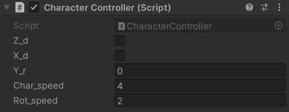
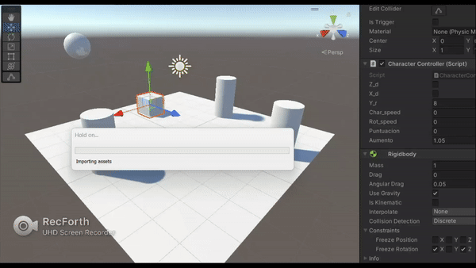
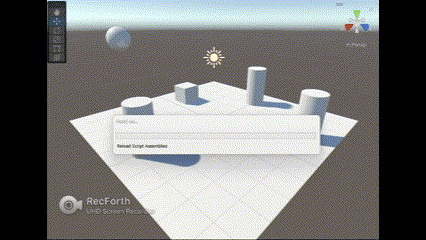
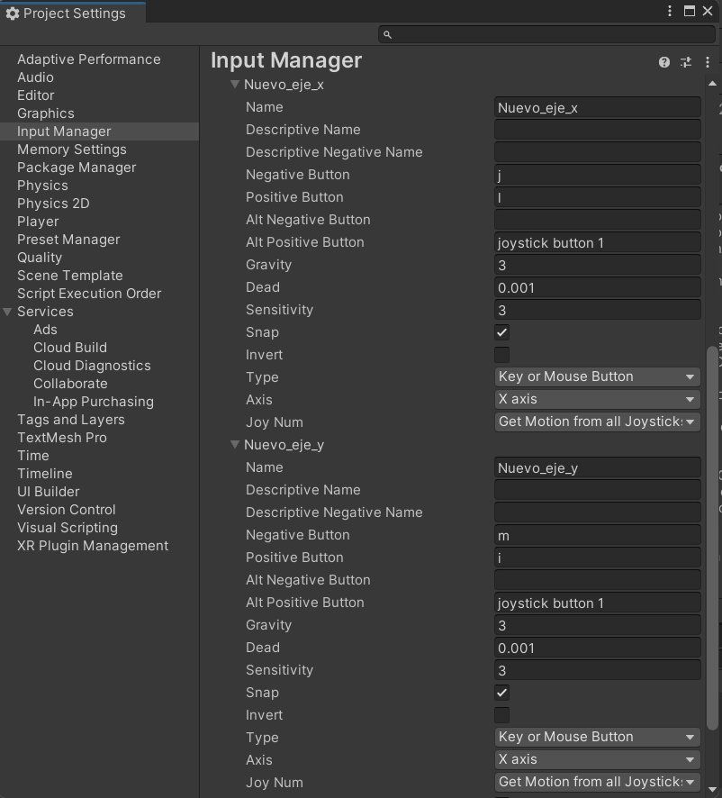
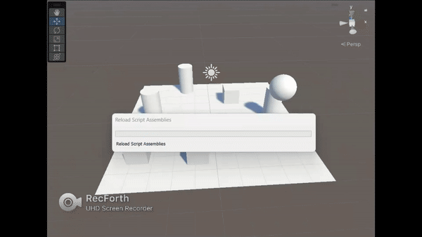

# Práctica 2 Interfaces Inteligentes
## Marta Molina Fernández

<!-- TABLE OF CONTENTS -->
<details open="open">
  <summary>Table of Contents</summary>
  <ol>
    <li><a href="#ejercicio-1">Ejercicio 1</a></li>
    <li>
      <a href="#ejercicio-2">Ejercicio 2</a>
    </li>
    <li><a href="#ejercicio-3">Ejercicio 3</a></li>
  </ol>
</details>

## Ejercicio 1
### A
Ninguno de los objetos es físico:


### B
La esfera es física gracias a Component > Physics > Rigidbody


### C
Ambos objetos tienen físicas


### D
Ambos son físicos y la esfera tiene 10 veces la masa del cubo


### E
Esfera física y el cubo es de tipo trigger


### F
La esfera tiene físicas y el cubo además de trigger, tiene físicas (activadas como anteriormente con el rigibody)


### G
La esfera, con una masa 10 veces mayor a la del cubo, y el cubo son físicos. Se impide la rotación del cubo sobre el plano XZ.

La masa se aumenta en el inspector como anteriormente se mostró.


## Ejercicio 2

El jugador (cubo) se mueve por los ejes ya creados horizontales y verticales. Hay dos campos públicos de velocidad: uno para el desplazamiento y otro para la rotación.



En Y_r vemos el valor entre -1 y 1 asignado para el giro continuo del jugador.

Código: 

``` C#

using System.Collections;
using System.Collections.Generic;
using UnityEngine;

public class CharacterController : MonoBehaviour
{
    public bool Z_d, X_d;
    public float Y_r;
    public float char_speed;
    public float rot_speed;


    // Start is called before the first frame update
    void Start()
    {
        char_speed=4;
        rot_speed=2;
    }

    // Update is called once per frame
    void Update()
    {
        X_d = Input.GetButton("Horizontal");
        Z_d = Input.GetButton("Vertical");
        Y_r = Input.GetAxis("Horizontal");

        if(Z_d) {
            transform.Translate(Vector3.forward * char_speed * Time.deltaTime);
        }
        if(X_d){
            transform.Rotate(0, Y_r * rot_speed, 0);
        } 
    }
}
```


## Ejercicio 3
### Primer apartado:
Varios cilindros que aumentan su tamaño cuando el jugador (cubo) colisione con ellos y el jugador aumenta su puntuación.

Código:
``` C#
using System.Collections;
using System.Collections.Generic;
using UnityEngine;

public class CharacterController : MonoBehaviour
{
    public bool Z_d, X_d;
    public float Y_r;
    public float char_speed;
    public float rot_speed;
    public int puntuacion;
    private GameObject cilindro;
    private GameObject cilindro1;
    private GameObject cilindro2;
    public float aumento = 1.05F;
    private double choque = 1.5;


    // Start is called before the first frame update
    void Start()
    {
        char_speed=4;
        rot_speed=2;
        puntuacion=0;

        cilindro = GameObject.FindWithTag("Cilindro");
        cilindro1 = GameObject.FindWithTag("Cilindro1");
        cilindro2 = GameObject.FindWithTag("Cilindro2");

    }

    // Update is called once per frame
    void Update()
    {
        X_d = Input.GetButton("Horizontal");
        Z_d = Input.GetButton("Vertical");
        Y_r = Input.GetAxis("Horizontal");

        if(Z_d) {
            transform.Translate(Vector3.forward * char_speed * Time.deltaTime);
        }
        if(X_d){
            transform.Rotate(0, Y_r * rot_speed, 0);
        } 
        //Debug.Log(Vector3.Distance(transform.position, cilindro.transform.position));
    }

    void OnCollisionEnter()
    {
        if(Vector3.Distance(transform.position, cilindro.transform.position) < choque){
            Debug.Log("Ha chocado el cubo con un cilindro esfera");
            puntuacion++;
            cilindro.transform.localScale *= aumento;
        }

        if(Vector3.Distance(transform.position, cilindro1.transform.position) < choque){
            Debug.Log("Ha chocado el cubo con un cilindro derecha");
            puntuacion++;
            cilindro1.transform.localScale *= aumento;
        }

        if(Vector3.Distance(transform.position, cilindro2.transform.position) < choque){
            Debug.Log("Ha chocado el cubo con un cilindro atras");
            puntuacion++;
            cilindro2.transform.localScale *= aumento;
        }
    }
```



### Segundo apartado:
Al acercarse el jugador, si la barra espaciadora está pulsada, uno de los cilindors se aleja del mismo gracias a la condición 

``` C#
Input.GetKey("space")
```

Código:
``` C#
using System.Collections;
using System.Collections.Generic;
using UnityEngine;

public class Cilindro : MonoBehaviour
{
    private Transform transf;
    public float fuerza = 5F;
    private GameObject cubo;
    private double cerca = 2;
    private Rigidbody rigid;


    // Start is called before the first frame update
    void Start()
    {
        transf = GetComponent<Transform>();
        cubo = GameObject.FindWithTag("Cubo");
        rigid = GetComponent<Rigidbody>();
    }

    // Update is called once per frame
    void Update()
    {
        if((Vector3.Distance(transf.position, cubo.transform.position) < cerca) && Input.GetKey("space")){
            Vector3 direction = transf.position - cubo.transform.position;
            rigid.AddForce(direction * fuerza);
        }
    }
}
```



### Tercer apartado:
Otro de los cilindros de la escena se aleja por un simple acercamiento del jugador. Es el mísmo código que el apartado anterior pero no hay necesidad de la condición que incluye la barra espaciadora.

``` C#
using System.Collections;
using System.Collections.Generic;
using UnityEngine;

public class Cilindro2 : MonoBehaviour
{

    private Transform transf;
    public float fuerza = 5F;
    private GameObject cubo;
    private double cerca = 2;
    private Rigidbody rigid;

    // Start is called before the first frame update
    void Start()
    {
        transf = GetComponent<Transform>();
        cubo = GameObject.FindWithTag("Cubo");
        rigid = GetComponent<Rigidbody>();
    }

    // Update is called once per frame
    void Update()
    {
        if(Vector3.Distance(transf.position, cubo.transform.position) < cerca){
            Vector3 direction = transf.position - cubo.transform.position;
            rigid.AddForce(direction * fuerza);
        }
    }
}
```


### Cuarto apartado:
Una nueva figura (esfera) que es capaz de detectar colisiones tiene además un eje nuevo

Código:
``` C#
using System.Collections;
using System.Collections.Generic;
using UnityEngine;

public class Esfera : MonoBehaviour
{
    public bool Z_d, X_d;
    public float Y_r;
    public float char_speed;
    public float rot_speed;

    // Start is called before the first frame update
    void Start()
    {
        char_speed=4;
        rot_speed=2;
    }

    // Update is called once per frame
    void Update()
    {
        X_d = Input.GetButton("Nuevo_eje_x");
        Z_d = Input.GetButton("Nuevo_eje_y");
        Y_r = Input.GetAxis("Nuevo_eje_x");

        if(Z_d) {
            transform.Translate(Vector3.forward * char_speed * Time.deltaTime);
        }
        if(X_d){
            transform.Rotate(0, Y_r * rot_speed, 0);
        } 
    }

    void OnCollisionEnter()
    {
        Debug.Log("La esfera ha colisionado");
    }
}
```

El movimiento de esta esfera se muestra en el gif del quinto apartado. A continuación una imagen de los nuevos ejes:



### Quinto apartado:
Se sitúan nuevos cubos además del jugador y cuando este se acerca, disminuyen su tamaño. Cuando se acerca la esfera, aumentan de tamaño.

Código añadido al jugador (cubo):
``` C#
//Declaración
private GameObject cubo1;
private GameObject cubo2;

//En la función Start
cubo1 = GameObject.FindWithTag("Cubo1");
cubo2 = GameObject.FindWithTag("Cubo2");

//En la función OnCollisionEnter
if(Vector3.Distance(transform.position, cubo1.transform.position) < choque){
    Debug.Log("Ha chocado el cubo con cubo atras");
    cubo1.transform.localScale /= aumento;
}

if(Vector3.Distance(transform.position, cubo2.transform.position) < choque){
    Debug.Log("Ha chocado el cubo con cubo izquierda");
    cubo2.transform.localScale /= aumento;
}
```

Código añadido a la esfera:
``` C#
//Declaración
private GameObject cubo1;
private GameObject cubo2;
public float aumento = 1.05F;
private double choque = 1.5;

//En la función Start
cubo1 = GameObject.FindWithTag("Cubo1");
cubo2 = GameObject.FindWithTag("Cubo2");

void OnCollisionEnter()
{
    Debug.Log("La esfera ha colisionado");

    if(Vector3.Distance(transform.position, cubo1.transform.position) < choque){
        Debug.Log("Ha chocado el esfera con cubo atras");
        cubo1.transform.localScale *= aumento;
    }

    if(Vector3.Distance(transform.position, cubo2.transform.position) < choque){
        Debug.Log("Ha chocado el esfera con cubo izquierda");
        cubo2.transform.localScale *= aumento;
    }
}
```


