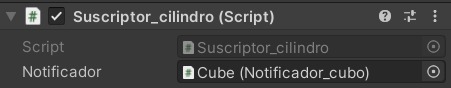
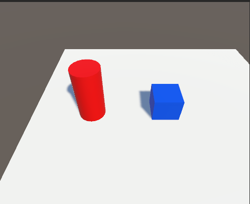
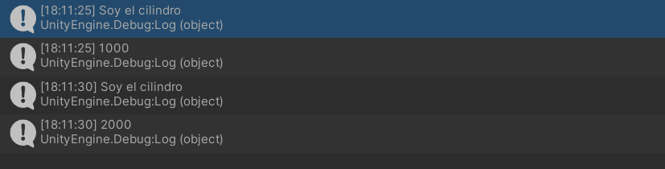
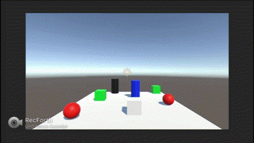
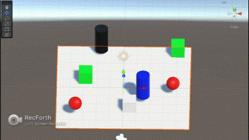

# Práctica 3 Interfaces Inteligentes
## Marta Molina Fernández

### Primer ejercicio
Creamos un notificador (cubo azul) y un suscriptor (cilindro rojo). En el inspector del suscriptor debemos indicar que el notificador al que debe escuchar es el cubo:



Imagen de la escena:



Salida por consola:




### Segundo ejercicio

Colisión con B:

Para detectar la colisión del jugador con un objeto B que tiene RigidBody:

```C#
public delegate void mensajeB();
public event mensajeB colisionB;
    
void OnCollisionEnter(Collision objeto)
{
    if(objeto.collider.tag == "B"){
        colisionB();
    }
}
```

Al colisionar con B, los objetos A se acercan al C:


Para conseguir esto en el script de los objetos A añadimos un evento en el start:

```C#
notificador.colisionB += movimiento_a_C;

void movimiento_a_C()
{
    Vector3 direccion = C.transform.position - transform.position;
    rigid.AddForce(direccion * velocidad);

    Debug.DrawRay(transform.position, direccion * 50, Color.blue, 100);
}
```

Cuando el jugador colisiona con un objeto A, el tamaño de los objetos B se incrementa:



```C#
notificador.colisionA += incrementoB;

void incrementoB()
{
    this.transform.localScale *= aumento;
}
```

La colisión se detecta de la misma forma que se mencionó en la primera parte del ejercicio.

Finalmente cuando un objeto se aproxima al objeto C, los de tipo A cambian de color, en este caso al azul y saltan, y los objetos de tipo B se orientan hacia un objetivo, el cilindro azul.



En este caso la notificación de la aproximación del jugador sale de la función Update:

```C#
void Update()
{
    avanzar = Input.GetButton("Vertical");
    girar = Input.GetAxis("Horizontal");

    if(avanzar) {
        transform.Translate(Vector3.forward * char_speed * Time.deltaTime);
    }
    transform.Rotate(0, girar * rot_speed, 0);


    if(Vector3.Distance(transform.position, C.transform.position) < aproximacion)
    {
        aproxC();
    }

}
```

Para los objetos de tipo A tenemos el código:
```C#
notificador.aproxC += color_salto_A;

void color_salto_A()
{
    this.GetComponent<Renderer>().material.color = Color.blue;

    if(distance_plain < 0.6F)
    {
        rigid.AddForce(Vector3.up * 2F, ForceMode.Impulse);
    }
}
```

Aquí vemos que primero cambiamos el color y posteriormente comprobamos que el objeto esté en el suelo para que salta, sin esta comprobación como la notificación sale del update, la esfera estará constantemente subiendo a menos que el jugador se alejase del objeto C. La distancia al plano se actualiza con la posición del objeto (su variable y).

Para los objetos de tipo B:
```C#
notificador.aproxC += rotacionB;

void rotacionB()
{
    Vector3 direccion = obj.transform.position - transform.position;
    transform.LookAt(direccion);

    Debug.DrawRay(transform.position, direccion * 30, Color.red, 100);
}
```
